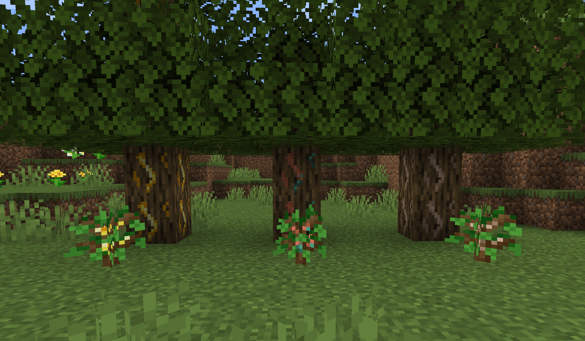
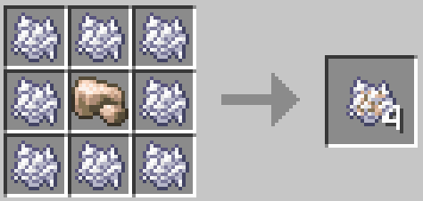
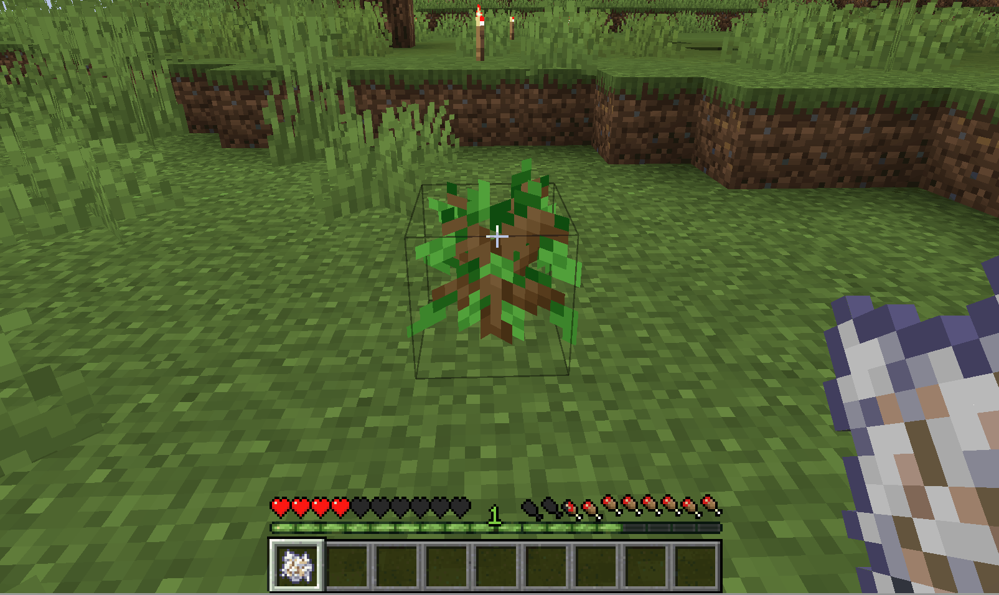
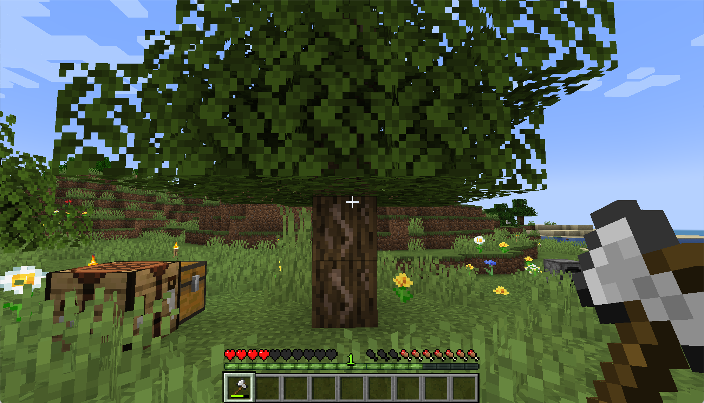
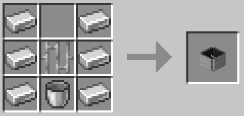
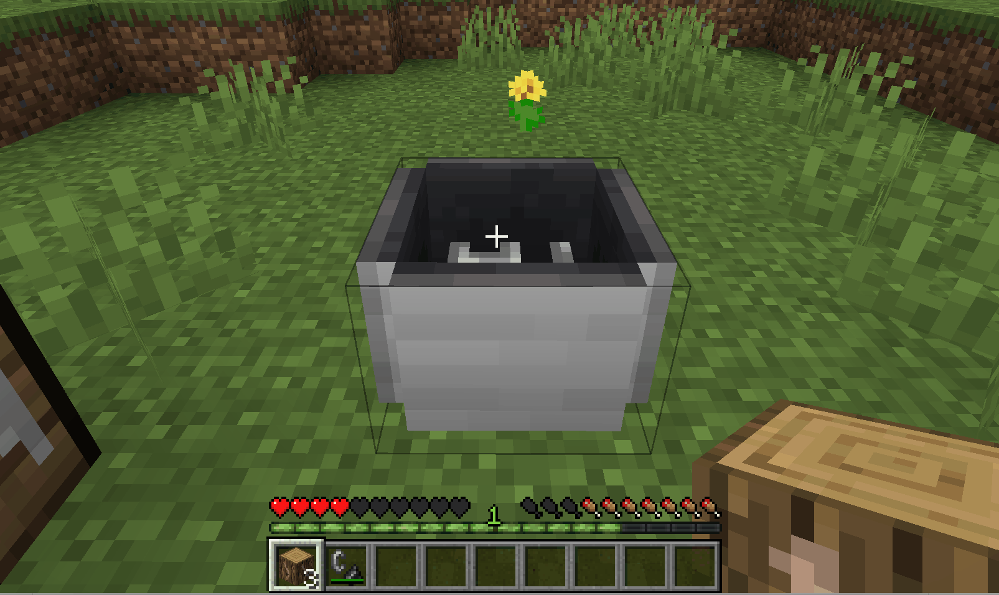
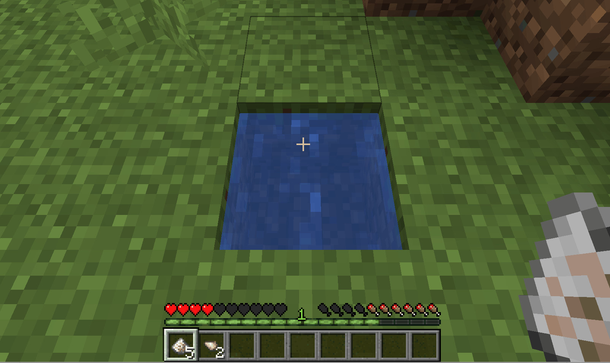
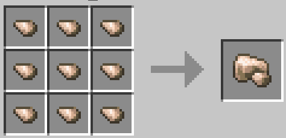
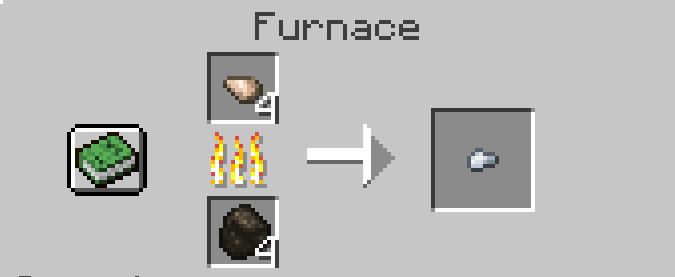
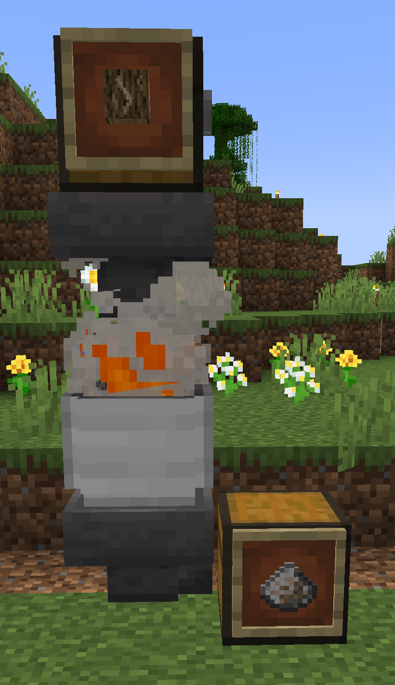

# Iron Oak

This mod aims to add several ore infused oak trees. This allows you to plant and farm ingot instead of mining them in
the dark.

**Compatibility**

| Version | Minecraft Version |
|---------|-------------------|
| 1.2.x   | 1.19.x            |
| 1.1.2   | 1.18.2            |

## Processing

> This also works with copper and gold.

To create your first *iron infused oak sapling* you have to create *iron infused bone meal*.

Apply this to any oak sapling to magically infuse the sapling:

Once the sapling is infused, you will see it grow into an *iron infused oak*. Cutting this tree will give you *iron
infused logs* which can be processed into ingot. But be careful if you cut this logs into planks all sparks of iron ore
getting lost.

Next you have to craft a *fire bowl*

This allows you to safely burn the logs and collect the ashes. Burning *iron infused logs* inside a fire bowl will
produce *iron infused ash*.

Now you can use water to wash the *iron infused ash* to receive *iron shreds*.

Once you have collected 9 shreds you can craft a *raw iron*.

Alternatively, you smelt the iron shred into nuggets.

## Automation

### Fire Bowl

The *fire bowl* will still burn for several seconds after a log is processed. This allows you to add some hopper to
automate your ash processing. But you have to ensure that you will not run out of logs. Otherwise, you have to ignite
the bowl again.

### Ore Washing

*Coming soon*