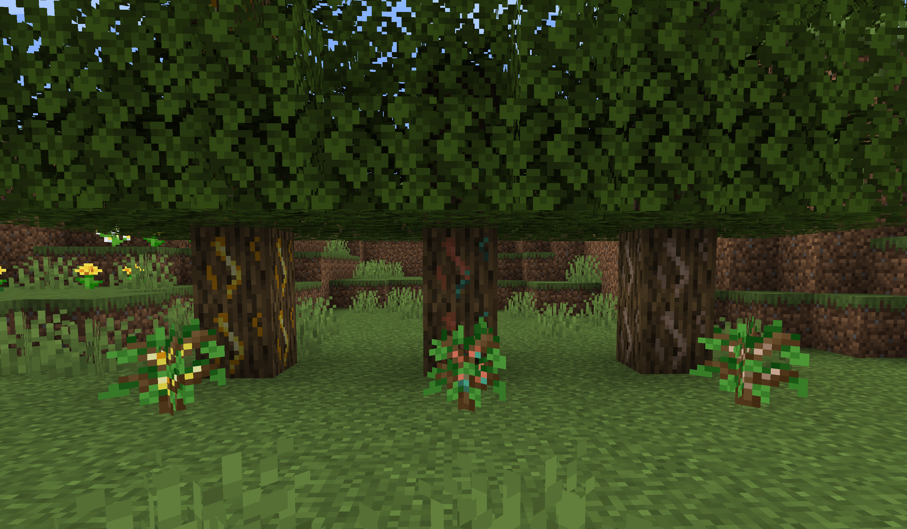
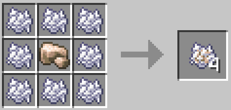
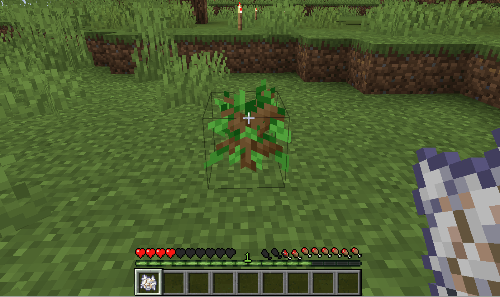
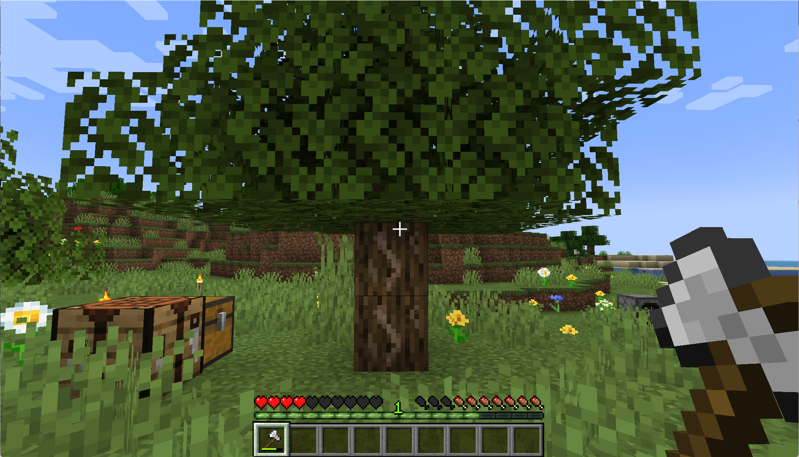
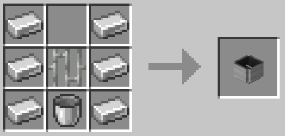
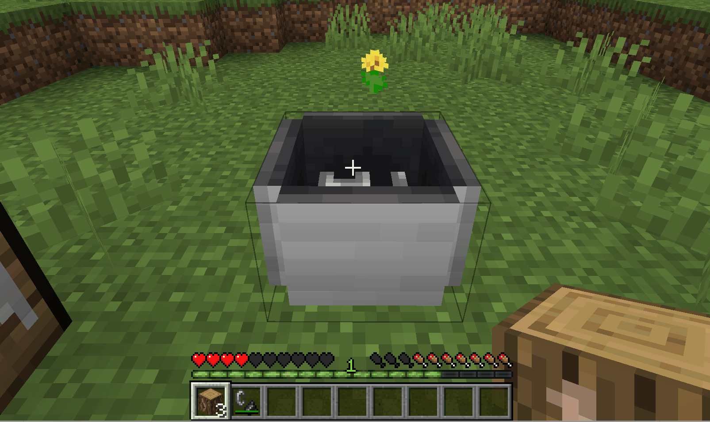
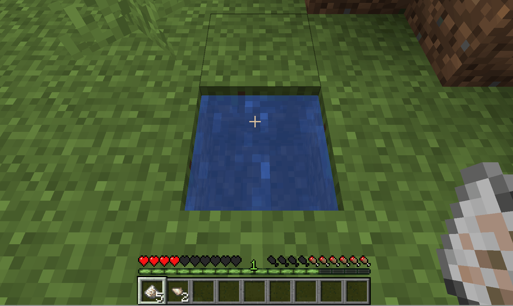
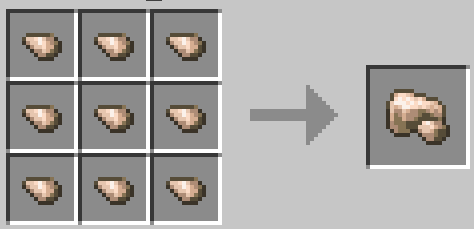
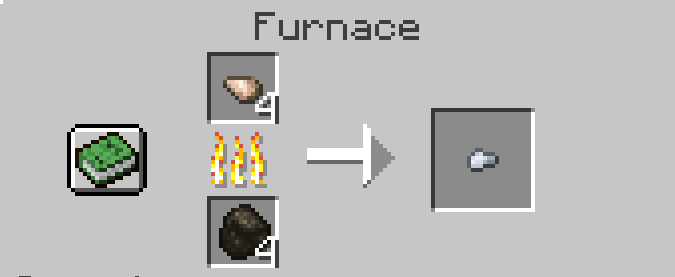
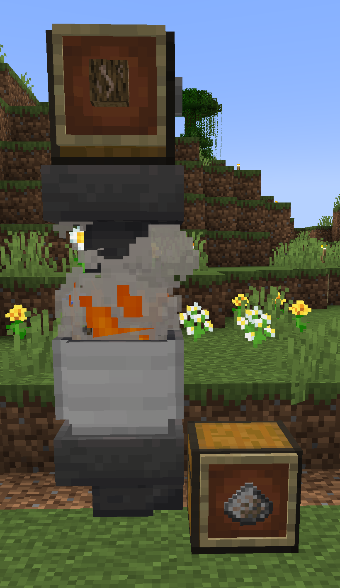

# Iron Oak

This mod aims to add several ore infused oak trees. This allows you to plant and farm ingot instead of mining them in
the dark.

**Compatibility**

| Version | Minecraft Version |
|---------|-------------------|
| 1.2.x   | 1.18.2, 1.19.x    |
| 1.1.2   | 1.18.2            |

## Processing

> This also works with copper and gold.

To create your first *iron infused oak sapling* you have to create *iron infused bone meal*.

Apply this to any oak sapling to magically infuse the sapling:

Once the sapling is infused, you will see it grow into an *iron infused oak*. Cutting this tree will give you *iron
infused logs* which can be processed into ingot. But be careful if you cut this logs into planks all sparks of iron ore
getting lost.

Next you have to craft a *fire bowl*

This allows you to safely burn the logs and collect the ashes. Burning *iron infused logs* inside a fire bowl will
produce *iron infused ash*.

Now you can use water to wash the *iron infused ash* to receive *iron shreds*.

Once you have collected 9 shreds you can craft a *raw iron*.

Alternatively, you smelt the iron shred into nuggets.

## Automation

### Fire Bowl

The *fire bowl* will still burn for several seconds after a log is processed. This allows you to add some hopper to
automate your ash processing. But you have to ensure that you will not run out of logs. Otherwise, you have to ignite
the bowl again.

### Ore Washing

*Coming soon*

## License

Iron Oak is **not** open source. It is distributed under the
[Iron Oak License 1.0](LICENSE) — all rights reserved, with the following
permissions granted to everyone up front:

- **Modpacks are welcome.** You may include Iron Oak in any modpack, public or
  private, free or paid, and bundle the mod file in your client or server pack.
  The only condition is that your modpack credits *Iron Oak* and links back to
  this repository. No need to ask first.
- **Add-ons are welcome.** Mods, patches, and resource packs that depend on
  Iron Oak are yours, under whatever license you like.
- **Reading and contributing is welcome.** Fork the repository, study the code,
  open a pull request.

What is not allowed without asking: redistributing the mod as a standalone
download or mirror outside of a modpack, and republishing it as a separate
project under another name.

Releases up to and including `1.2.1+1.20.4` were published under the MIT
License and stay MIT.
